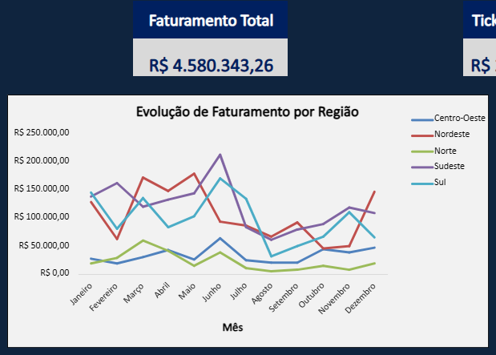
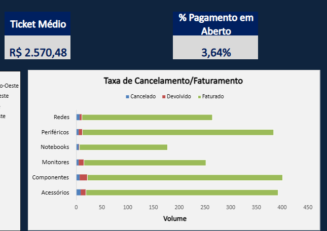
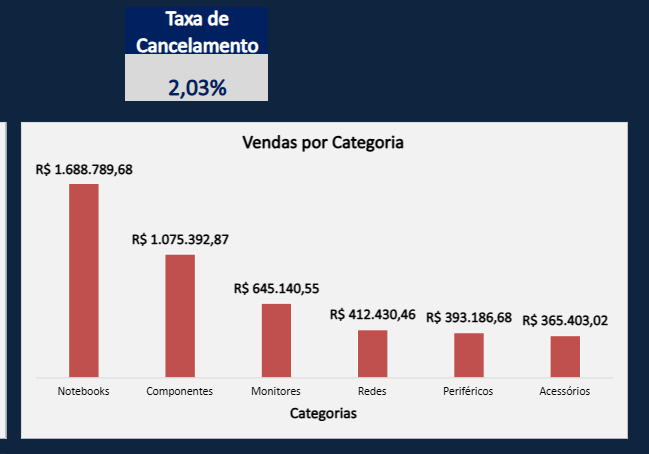
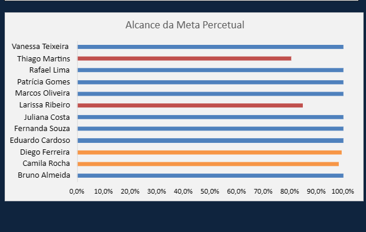
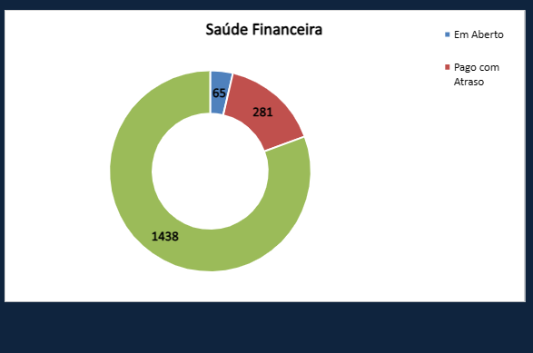
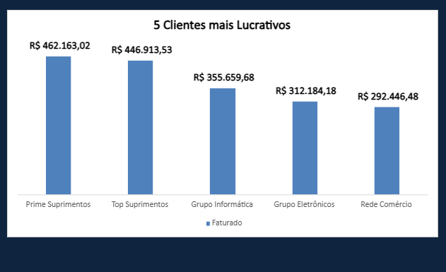
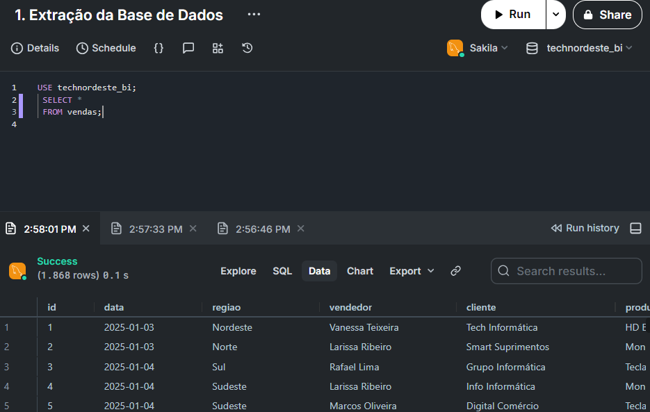
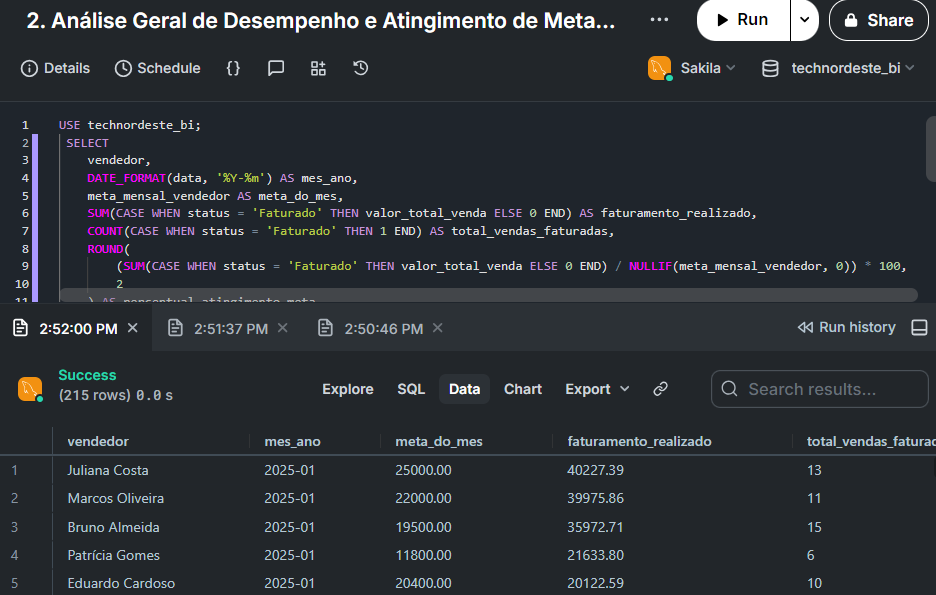
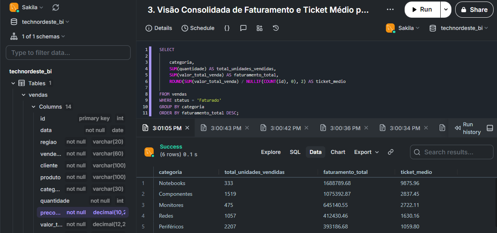

# 🏢 TechNordeste — Análise Comercial e Financeira B2B

Simulação e análise de dados operacionais de uma distribuidora B2B de eletrônicos e informática, ao longo de **18 meses de operação** (Jan/2025 a Jun/2026). O projeto foi construído em três frentes — Excel, SQL e Power BI — pra responder as mesmas perguntas de negócio por caminhos diferentes e comparar os resultados entre si.

---

## 📌 Visão Geral

O objetivo foi simular a rotina real de uma empresa B2B e transformar dado bruto em decisão, olhando para quatro pilares:

* **Sazonalidade e comportamento regional** — onde e quando a empresa vende mais
* **Performance do time comercial** — quem bate meta e quem precisa de atenção
* **Saúde financeira** — pontualidade de pagamento e inadimplência
* **Concentração de clientes** — quais contas sustentam o faturamento

> **Fonte do dataset:** massa de dados fictícia, gerada com apoio de IA (Claude), desenhada para simular gargalos operacionais reais de uma distribuidora B2B — sazonalidade, vendedor abaixo da meta, cliente inadimplente, produto com devolução acima do normal.

---

## 🛠️ Ferramentas e Fluxo de Trabalho

| Ferramenta | Papel no projeto |
|---|---|
| **Excel** | Modelagem da base, Tabela Dinâmica, fórmulas (`SOMASES`, `MÉDIASES`, `CONT.SES`) e primeiro dashboard |
| **SQL (MySQL)** | Extração relacional, agregações por categoria/vendedor/mês, e validação cruzada dos números do Excel |

---

## 💡 5 Principais Insights de Negócio

1. **Ticket alto sustenta a receita** — Notebooks lidera o faturamento (R$ 1,68 mi) mesmo vendendo poucas unidades (333, contra 2.207 de Periféricos). Produto caro compensa baixo volume.
2. **Metas descalibradas na equipe** — a maioria bate meta, mas dois vendedores operam bem abaixo (Thiago Martins ~80,6%, Larissa Ribeiro ~85%). Aponta pra carteira de cliente mal dividida ou meta irreal pra região.
3. **Atrasos apertam o caixa** — só 3,64% dos pagamentos ficam totalmente em aberto, mas 281 das 1.868 vendas (quase 20% do faturado) chegam atrasadas. A política de cobrança de boletos merece revisão.
4. **Operação de pedidos é eficiente** — taxa de cancelamento pré-faturamento é de apenas 2,03%. Quase tudo que o time vende realmente vira pedido faturado.
5. **Risco concentrado nos top clientes** — 5 clientes somam R$ 1,87 mi (mais de 1/3 do faturamento total). Perder o Prime Suprimentos sozinho já custaria ~10% de todo o faturamento da empresa.

---

## 📐 Regras de Negócio e Métricas

| Métrica / Regra | Definição Operacional |
|---|---|
| **Faturamento** | `Quantidade × Preço Unitário`, somando apenas pedidos com `status = Faturado`. Cancelado e devolvido nunca entram. |
| **Ticket Médio** | Faturamento Total ÷ número de vendas faturadas. |
| **Atingimento de Meta** | Faturamento realizado pelo vendedor **no mesmo mês** comparado à meta **daquele mesmo mês** — nunca faturamento acumulado de vários meses contra a meta de um mês só. |
| **Status Financeiro** | À vista e cartão = liquidação imediata → sempre `Pago em Dia`. Boleto (30/60 dias) varia entre `Pago em Dia`, `Pago com Atraso` e `Em Aberto`, conforme data de pagamento x vencimento. |
| **Diferenciação de eventos** | **Cancelamento:** pedido que não chegou a faturar. **Devolução:** produto que voltou depois de faturado. **Churn:** cliente sem compras após determinado período — métrica diferente de cancelamento, não coberta neste dashboard. |
| **Período de análise** | Dados acumulados de 18 meses corridos (Jan/2025–Jun/2026), sem anualização ou projeção. |

---

## 📊 Leitura Detalhada dos Gráficos

### 🗺️ Evolução de Faturamento por Região

Sudeste e Sul puxam os picos do meio do ano (Junho passa de R$ 200 mil no Sudeste), enquanto Centro-Oeste e Norte seguem praticamente lineares, perto de zero, o período inteiro. Sinaliza onde reforçar ação comercial ou concentrar logística onde a demanda já está consolidada.

### 📦 Taxa de Cancelamento e Devolução por Categoria

Componentes, Periféricos e Acessórios concentram o maior volume de pedidos (perto de 400 cada). Mesmo assim, a taxa geral de cancelamento fica em 2,03% — a operação de pré-venda é assertiva.

### 💻 Vendas por Categoria

Notebooks atinge R$ 1,68 milhão isolado na liderança, mesmo sem ser a categoria mais vendida em unidades — o valor agregado do produto compensa o volume menor frente a Acessórios (R$ 365 mil).

### 🎯 Alcance da Meta Percentual (Time Comercial)

* 🔴 **Vermelho** — desempenho crítico, mais de 15% abaixo da meta: Thiago Martins (~80,6%) e Larissa Ribeiro (~85%)
* 🟠 **Laranja** — levemente abaixo da meta (até 15% de desvio): Camila Rocha e Diego Ferreira
* 🔵 **Azul** — atingiu ou superou 100%: maioria do time

Permite mirar o gargalo em performance individual sem penalizar quem está entregando acima.

### 💳 Saúde Financeira e Inadimplência

Das 1.868 transações: 1.438 pagas em dia, 281 pagas com atraso, 65 em aberto (3,64%). A inadimplência grave é baixa, mas o volume de atraso reduz a previsibilidade do caixa mês a mês.

### 🏆 5 Clientes Mais Lucrativos

Prime Suprimentos (R$ 462,1 mil) e Top Suprimentos (R$ 446,9 mil) lideram a carteira. Perder qualquer um dos 5 impacta o faturamento global de forma direta e imediata — justifica um atendimento dedicado pra essas contas.

---

## 🗄️ Consultas SQL (validação cruzada com o Excel)

O SQL entrou no projeto depois do Excel, com um objetivo bem prático: **conferir se os números batiam** rodando a mesma lógica de negócio num banco relacional, sem depender de Tabela Dinâmica.

### 1. Extração da Base de Dados

```sql
USE technordeste_bi;
SELECT * FROM vendas;
```
A mais simples das três: traz as 1.868 linhas cruas, do jeito que estão no banco. Serve como conferência de importação — mesma contagem de linhas e mesmas colunas do arquivo Excel original, incluindo o `id` auto-incremento e o `valor_total_venda` já calculado.

### 2. Análise Geral de Desempenho e Atingimento de Meta por Vendedor/Mês

```sql
USE technordeste_bi;
SELECT 
    vendedor,
    DATE_FORMAT(data, '%Y-%m') AS mes_ano,
    meta_mensal_vendedor AS meta_do_mes,
    SUM(CASE WHEN status = 'Faturado' THEN valor_total_venda ELSE 0 END) AS faturamento_realizado,
    COUNT(CASE WHEN status = 'Faturado' THEN 1 END) AS total_vendas_faturadas,
    ROUND(
      (SUM(CASE WHEN status = 'Faturado' THEN valor_total_venda ELSE 0 END)
       / NULLIF(meta_mensal_vendedor, 0)) * 100, 2
    ) AS atingimento_meta_pct
FROM vendas
GROUP BY vendedor, mes_ano, meta_mensal_vendedor
ORDER BY vendedor, mes_ano;
```
Essa foi a consulta mais importante do projeto. Ela agrupa por **vendedor e mês ao mesmo tempo** — exatamente a regra que corrigimos no Excel e no Power BI depois do bug do "1.900% de atingimento" (comparar faturamento de vários meses contra a meta de um mês só). Rodar isso no SQL foi o jeito mais rápido de confirmar, linha por linha nas 215 combinações vendedor/mês, que a lógica estava certa antes de replicar a mesma regra no Power BI.

### 3. Visão Consolidada de Faturamento e Ticket Médio por Categoria

```sql
SELECT
    categoria,
    SUM(quantidade) AS total_unidades_vendidas,
    SUM(valor_total_venda) AS faturamento_total,
    ROUND(SUM(valor_total_venda) / NULLIF(COUNT(id), 0), 2) AS ticket_medio
FROM vendas
WHERE status = 'Faturado'
GROUP BY categoria
ORDER BY faturamento_total DESC;
```
Essa trouxe um ângulo que não estava tão visível no dashboard do Excel: o **ticket médio por categoria**. Notebooks não lidera só em faturamento total — o ticket médio por venda é R$ 9.875,96, quase **9 vezes maior** que o de Periféricos (R$ 1.059,80). O SQL serviu aqui pra confirmar rápido, sem montar uma Tabela Dinâmica nova, que a categoria de maior faturamento também é, disparado, a de maior valor por pedido.

**Por que vale ter as duas ferramentas lado a lado:** o Excel mostra rápido "o quê" (o gráfico, o KPI), mas o SQL obriga a escrever a regra de negócio de forma explícita no `GROUP BY` e no `CASE WHEN` — é onde erros de agregação (como o da meta) ficam mais fáceis de enxergar e mais difíceis de esconder atrás de um filtro de Tabela Dinâmica mal configurado.

---

## 🏗️ Estrutura da Análise e Lógica de Dados

O fluxo do projeto foi desenhado para garantir **rastreabilidade total do dado** (*data lineage*), desde a ingestão da massa bruta até a geração de insights estratégicos para a tomada de decisão:

```text
                     ┌─────────────────────────────────┐
                     │       1. CAMADA DE ORIGEM       │
                     │   Massa de Dados Fictícia (IA)  │
                     │    1.868 registros (CSV/XLSX)   │
                     └────────────────┬────────────────┘
                                      │
         ┌────────────────────────────┴────────────────────────────┐
         ▼                                                         ▼
┌───────────────────────────────┐                         ┌───────────────────────────────┐
│     2A. BANCO DE DADOS        │                         │   2B. PROCESSAMENTO EXCEL     │
│ - Schema Relacional (MySQL)   │                         │ - Ingestão dos Dados           │
│ - Carga da Tabela `vendas`    │                         │ - Limpeza e Modelagem         │
│ - Consultas & Queries (.sql)  │                         │ - Agregações via Dinâmica     │
└────────┬──────────────────────┘                         └────────┬──────────────────────┘
         │                                                         │
         │             ┌─────────────────────────┐                 │
         └────────────►│  3. VALIDAÇÃO CRUZADA   │◄────────────────┘
                       │ Output MySQL vs. Excel  │
                       └────────────┬────────────┘
                                    │
                                    │ (Dados Auditados & Consistentes)
                                    ▼
                       ┌─────────────────────────┐
                       │  4. CAMADA DE NEGÓCIO   │
                       │   Insights Estratégicos │
                       │    & Tomada de Decisão  │
                       └─────────────────────────┘

## 📄 Fonte dos Dados

Dataset 100% fictício, gerado com apoio de IA (Claude) para fins de portfólio e estudo — simula problemas operacionais reais de uma distribuidora B2B.
